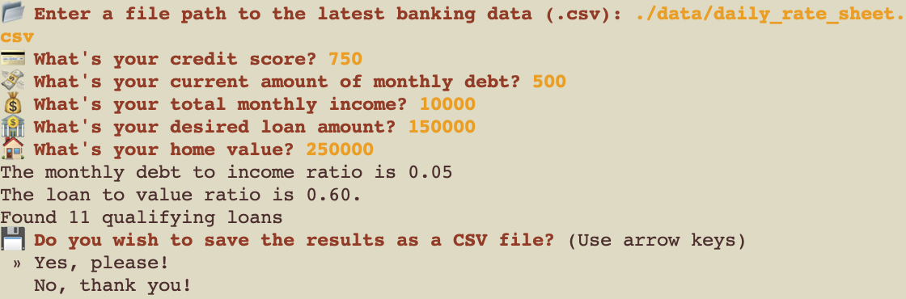
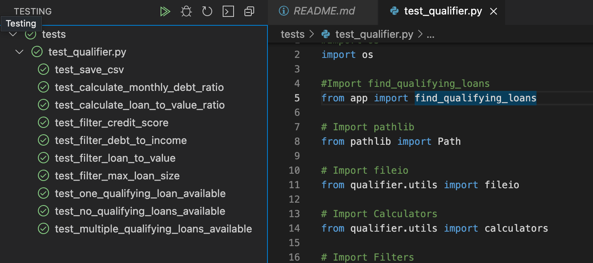
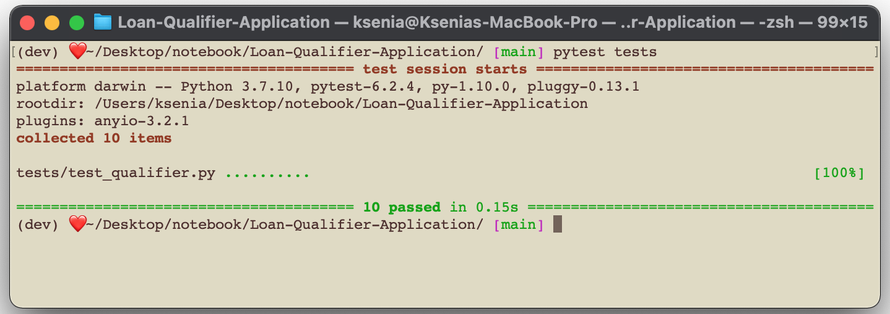

# Loan Qualifier Application

This is the command-line interface application that gets the applicant's financial information and determines which loans user qualifies for.


---

## Technologies

This project leverages python 3.7 with the following packages:

* sys- provides access to some variables used or maintained by the interpreter and to       functions that interact strongly with the interpreter

* fire - for the command line interface, the run function

* questionary - for interactive user prompts and dialogs

* csv - for reading and writing CSV files

* pathlib - for identifying a file 

* os - for removing the test output file

---

## Installation Guide
Before running the application install the following dependencies

```python
pip install fire
pip install questionary
pip install pytest
```

---

## Usage

To use the loan qualifier application simply clone the repository and run app.py

```python
python app.py
```

Upon launching the application you will be asked to enter a file path to the latest banking data, the default is set to ./data/daily_rate_sheet.csv


---

## Examples
*The example use of the Loan Qualifier Application from the CLI*



---

## Testing
The loan qualifier application uses pytest for automated testing. Tests can be run using the Visual Studio Code built-in test-runner: 



Or using pytest on the command line using `pytests tests` from the top-level project directory:



---


## Contributors
Brought to you by Ksenia Gorska as part of the UC Berkeley Extension Bootcamp: UCB-VIRT-FIN-PT-06-2021-U-B-MW
Ksenia Gorska
e-mail: kseniagorska@icloud.com
[linkedin:](https://www.linkedin.com/in/ksenia-gorska/)


---

## License

The MIT License
